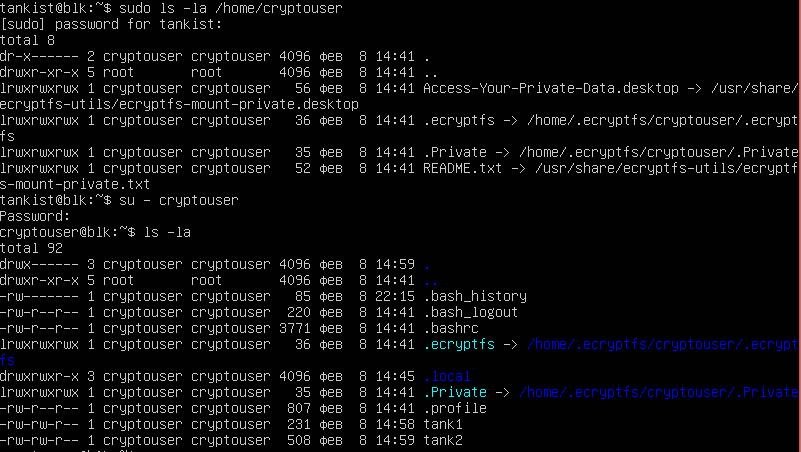

# Домашнее задание к занятию «Защита хоста»

## Задание 1
Установка eCryptfs:
```
root@blk:/home/tankist# apt-get install ecryptfs-utils -y
Чтение списков пакетов… Готово
Построение дерева зависимостей… Готово
Чтение информации о состоянии… Готово
Будут установлены следующие дополнительные пакеты:
  keyutils libecryptfs1 libtspi1
Следующие НОВЫЕ пакеты будут установлены:
  ecryptfs-utils keyutils libecryptfs1 libtspi1
Обновлено 0 пакетов, установлено 4 новых пакетов, для удаления отмечено 0 пакетов, и 65 пакетов не обновлено.
Необходимо скачать 340 kB архивов.
После данной операции объём занятого дискового пространства возрастёт на 1 313 kB.
Пол:1 http://ru.archive.ubuntu.com/ubuntu jammy/universe amd64 libecryptfs1 amd64 111-5ubuntu1 [36,0 kB]
Пол:2 http://ru.archive.ubuntu.com/ubuntu jammy/universe amd64 libtspi1 amd64 0.3.15-0.2 [160 kB]
Пол:3 http://ru.archive.ubuntu.com/ubuntu jammy/main amd64 keyutils amd64 1.6.1-2ubuntu3 [50,4 kB]
Пол:4 http://ru.archive.ubuntu.com/ubuntu jammy/universe amd64 ecryptfs-utils amd64 111-5ubuntu1 [93,6 kB]
Получено 340 kB за 0с (956 kB/s)
Выбор ранее не выбранного пакета libecryptfs1.
(Чтение базы данных … на данный момент установлено 76659 файлов и каталогов.)
Подготовка к распаковке …/libecryptfs1_111-5ubuntu1_amd64.deb …
Распаковывается libecryptfs1 (111-5ubuntu1) …
Выбор ранее не выбранного пакета libtspi1.
Подготовка к распаковке …/libtspi1_0.3.15-0.2_amd64.deb …
Распаковывается libtspi1 (0.3.15-0.2) …
Выбор ранее не выбранного пакета keyutils.
Подготовка к распаковке …/keyutils_1.6.1-2ubuntu3_amd64.deb …
Распаковывается keyutils (1.6.1-2ubuntu3) …
Выбор ранее не выбранного пакета ecryptfs-utils.
Подготовка к распаковке …/ecryptfs-utils_111-5ubuntu1_amd64.deb …
Распаковывается ecryptfs-utils (111-5ubuntu1) …
Настраивается пакет libtspi1 (0.3.15-0.2) …
Настраивается пакет libecryptfs1 (111-5ubuntu1) …
Настраивается пакет keyutils (1.6.1-2ubuntu3) …
Настраивается пакет ecryptfs-utils (111-5ubuntu1) …
Обрабатываются триггеры для man-db (2.10.2-1) …
Обрабатываются триггеры для libc-bin (2.35-0ubuntu3.13) …
Scanning processes...
Scanning linux images...
Running kernel seems to be up-to-date.
No services need to be restarted.
No containers need to be restarted.
No user sessions are running outdated binaries.
No VM guests are running outdated hypervisor (qemu) binaries on this host.
```
Создание пользователя cryptouser и зашифрованных файлов в его домашнем каталоге:
```
root@blk:/home/tankist# adduser --encrypt-home cryptouser
Adding user `cryptouser' ...
Adding new group `cryptouser' (1001) ...
Adding new user `cryptouser' (1001) with group `cryptouser' ...
Creating home directory `/home/cryptouser' ...
Setting up encryption ...
************************************************************************
YOU SHOULD RECORD YOUR MOUNT PASSPHRASE AND STORE IT IN A SAFE LOCATION.
  ecryptfs-unwrap-passphrase ~/.ecryptfs/wrapped-passphrase
THIS WILL BE REQUIRED IF YOU NEED TO RECOVER YOUR DATA AT A LATER TIME.
************************************************************************
Done configuring.
Copying files from `/etc/skel' ...
New password: object_299
Retype new password: object_299
passwd: password updated successfully
Changing the user information for cryptouser
Enter the new value, or press ENTER for the default
        Full Name []: Sergey Avdevnin
        Room Number []:
        Work Phone []:
        Home Phone []:
        Other []:
Is the information correct? [Y/n] y

tankist@blk:~$ su - cryptouser
cryptouser@blk:~$ nano tank1
cryptouser@blk:~$ nano tank2
```
На рисунке ниже продемонстрирована разница представления зашифрованного домашнего каталога пользователя cryptouser для «посторонних» и для владельца.

</br>
Рисунок 1.1. Отображение содержимого зашифрованного каталога для «посторонних» (вверху) и для владельца (внизу).

## Задание 2

Скриншоты такого большого количества текста сделать проблематично, поэтому демонстрация будет непосредственно в «коде»</br>
Установка поддержки LUKS:
```
root@blk:/home/tankist# apt-get install cryptsetup -y
Чтение списков пакетов… Готово
Построение дерева зависимостей… Готово
Чтение информации о состоянии… Готово
Следующие пакеты будут обновлены:
  cryptsetup
Обновлено 1 пакетов, установлено 0 новых пакетов, для удаления отмечено 0 пакетов, и 64 пакетов не обновлено.
Необходимо скачать 194 kB архивов.
После данной операции объём занятого дискового пространства возрастёт на 1 024 B.
Пол:1 http://ru.archive.ubuntu.com/ubuntu jammy-updates/main amd64 cryptsetup amd64 2:2.4.3-1ubuntu1.3 [194 kB]
Получено 194 kB за 0с (620 kB/s)
Предварительная настройка пакетов …
(Чтение базы данных … на данный момент установлено 76755 файлов и каталогов.)
Подготовка к распаковке …/cryptsetup_2%3a2.4.3-1ubuntu1.3_amd64.deb …
Распаковывается cryptsetup (2:2.4.3-1ubuntu1.3) на замену (2:2.4.3-1ubuntu1.2) …
Настраивается пакет cryptsetup (2:2.4.3-1ubuntu1.3) …
Обрабатываются триггеры для man-db (2.10.2-1) …
Scanning processes...
Scanning linux images...
Running kernel seems to be up-to-date.
No services need to be restarted.
No containers need to be restarted.
No user sessions are running outdated binaries.
No VM guests are running outdated hypervisor (qemu) binaries on this host.

root@blk:/home/tankist# cryptsetup --version
cryptsetup 2.4.3
```
Для выполнения данного задания был создан дополнительный виртуальный жёсткий диск и на нём уже зашифрованный раздел.</br> 
Просмотр разделов до начала выполнения задания:
```
root@blk:/home/tankist# lsblk
NAME   MAJ:MIN RM  SIZE RO TYPE MOUNTPOINTS
loop0    7:0    0 91,4M  1 loop /snap/lxd/36918
loop1    7:1    0   87M  1 loop /snap/lxd/29351
loop2    7:2    0 38,8M  1 loop /snap/snapd/21759
loop3    7:3    0 63,9M  1 loop /snap/core20/2318
loop4    7:4    0 48,1M  1 loop /snap/snapd/25935
loop5    7:5    0 63,8M  1 loop /snap/core20/2686
sda      8:0    0  100G  0 disk
├─sda1   8:1    0    1M  0 part
└─sda2   8:2    0  100G  0 part /
sdb      8:16   0  100M  0 disk
sr0     11:0    1 1024M  0 rom
```
Создание точки монтирования будущего раздела:
```
root@blk:/home/tankist# mkdir /mnt/crypto
```
Создание раздела:
```
root@blk:/home/tankist# fdisk /dev/sdb
Welcome to fdisk (util-linux 2.37.2).
Changes will remain in memory only, until you decide to write them.
Be careful before using the write command.
Device does not contain a recognized partition table.
Created a new DOS disklabel with disk identifier 0x622c7a38.
Command (m for help): g
Created a new GPT disklabel (GUID: 836ABFB0-ABF9-2745-A1CA-7804281E3450).
Command (m for help): n
Partition number (1-128, default 1):
First sector (2048-204766, default 2048):
Last sector, +/-sectors or +/-size{K,M,G,T,P} (2048-204766, default 204766):
Created a new partition 1 of type 'Linux filesystem' and of size 99 MiB.
Command (m for help): w
The partition table has been altered.
Calling ioctl() to re-read partition table.
```
Шифрование, форматирование и монтирование раздела:
```
root@blk:/home/tankist# cryptsetup -y -v --type luks2 luksFormat /dev/sdb1
WARNING!
========
This will overwrite data on /dev/sdb1 irrevocably.
Are you sure? (Type 'yes' in capital letters): YES
Enter passphrase for /dev/sdb1: object_187
Verify passphrase: object_187
Key slot 0 created.
Command successful.

root@blk:/home/tankist# cryptsetup open /dev/sdb1 disk
Enter passphrase for /dev/sdb1: object_187
root@blk:/home/tankist# ls /dev/mapper/disk
/dev/mapper/disk
root@blk:/home/tankist# dd if=/dev/zero of=/dev/mapper/disk
dd: writing to '/dev/mapper/disk': No space left on device
169952+0 records in
169951+0 records out
87014912 bytes (87 MB, 83 MiB) copied, 1,53327 s, 56,8 MB/s

root@blk:/home/tankist# mkfs.ext4 /dev/mapper/disk
mke2fs 1.46.5 (30-Dec-2021)
Creating filesystem with 21243 4k blocks and 21248 inodes
Allocating group tables: done
Writing inode tables: done
Creating journal (1024 blocks): done
Writing superblocks and filesystem accounting information: done

root@blk:~# mount /dev/mapper/disk /mnt/crypto
```
Просмотр разделов после выполнения задания:
```
root@blk:~# lsblk
NAME     MAJ:MIN RM  SIZE RO TYPE  MOUNTPOINTS
loop0      7:0    0 38,8M  1 loop  /snap/snapd/21759
loop1      7:1    0 91,4M  1 loop  /snap/lxd/36918
loop2      7:2    0   87M  1 loop  /snap/lxd/29351
loop3      7:3    0 48,1M  1 loop  /snap/snapd/25935
loop4      7:4    0 63,9M  1 loop  /snap/core20/2318
loop5      7:5    0 63,8M  1 loop  /snap/core20/2686
sda        8:0    0  100G  0 disk
├─sda1     8:1    0    1M  0 part
└─sda2     8:2    0  100G  0 part  /
sdb        8:16   0  100M  0 disk
└─sdb1     8:17   0   99M  0 part
  └─disk 253:0    0   83M  0 crypt /mnt/crypto
sr0       11:0    1 1024M  0 rom
```
Проверка шифрования:
```
root@blk:~# cryptsetup luksDump /dev/sdb1
LUKS header information
Version:        2
Epoch:          3
Metadata area:  16384 [bytes]
Keyslots area:  16744448 [bytes]
UUID:           cd80eb6b-3da7-46d5-83b9-ecafbf69e7b0
Label:          (no label)
Subsystem:      (no subsystem)
Flags:          (no flags)
Data segments:
  0: crypt
        offset: 16777216 [bytes]
        length: (whole device)
        cipher: aes-xts-plain64
        sector: 512 [bytes]
Keyslots:
  0: luks2
        Key:        512 bits
        Priority:   normal
        Cipher:     aes-xts-plain64
        Cipher key: 512 bits
        PBKDF:      argon2id
        Time cost:  4
        Memory:     360754
        Threads:    1
        Salt:       87 91 66 43 1a 56 01 30 7a 6d ff 1b 7e ad ed ca
                    be ab 79 ee db 55 99 15 08 ce 6f 3c 11 c6 48 cf
        AF stripes: 4000
        AF hash:    sha256
        Area offset:32768 [bytes]
        Area length:258048 [bytes]
        Digest ID:  0
Tokens:
Digests:
  0: pbkdf2
        Hash:       sha256
        Iterations: 72736
        Salt:       88 ae 57 25 23 bd a3 6c 38 f8 b3 43 28 06 f9 20
                    ff ad 60 2d 92 8b d2 eb 89 89 ff 39 4d e9 3b ea
        Digest:     15 a6 b0 29 2c 6d 7f 77 d0 13 0a d2 12 41 0f 08
                    a6 f3 0f eb 5e 15 ce 81 5c 81 63 80 90 7d 97 4b
```
Отмонтирование и закрытие раздела:
```
root@blk:~# umount /mnt/crypto
root@blk:~# cryptsetup luksClose disk
```